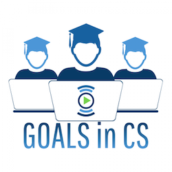
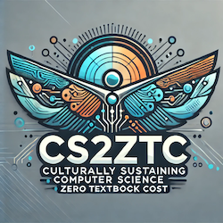

<!-- Main -->

<!-- One -->
<section id="one">
	

		<header class="major">
			<h2>Overview</h2>
		</header>
		
The pages below contain the open educational resources (OER) that our department developed/uses for our CS courses, consolidated here to share those materials with the CS education community. These materials were mostly created through two grants awarded to our department:

        <ul>
            <li style="font-weight: bold; font-style: italic;">Giving Ownership of Active Learning to Students in Computer Science (GOALS in CS):</li>
                <ul style="display: flex;">
                    
                    <li style="align-self: flex-end;">
                    A <a href="https://calearninglab.org/project/giving-ownership-of-active-learning-to-students-in-computer-science/">California Learning Lab grant</a> in partnership between CSU San Marcos, MiraCosta College, and Carnegie Mellon University's (CMU's) Open Learning Iniatitive, redesigned CS111 and CS112 from the ground up. The projects goal was to create culturally responsive learning resources and activities, and build a variety of student-focused and selectable modules that are adaptive to students’ personal characteristics, background contexts, and learning experiences. In addition to online modules with learning goals assigned and assessed throughout the week, the newly developed courses will include weekly face-to-face lab activities that engage students in project-based learning and help students navigate and better understand the discipline of CS, thereby empowering students at the introductory level to gain a cognitive map of the field itself.
                    </li>
                </ul>

            <li style="font-weight: bold; font-style: italic;">Computer Science Culturally Sustaining Zero Textbook Cost (CS2ZTC):</li>
                <ul style="display: flex;">
                    
                    <li style="align-self: flex-end;">
                    While Computer Science and STEM fields in general often come with an expensive price tag for textbook costs, MiraCosta’s Computer Science program has already started to offer Zero Textbook Cost (ZTC) offerings for our courses. This grant will allow us to continue the work we have begun in making attainment of a CS degree more possible. Integrating current research to promote equitable student success is a key component of our department’s philosophy, and the materials we develop will build on work we have already done to create interactive tools through real world applications relevant to our student population. In particular, use of OER, culturally relevant/responsive/sustaining pedagogy, decolonization, and active learning strategies are at the center of our approach.
                    </li>
                </ul>
        </ul>
	

</section>

